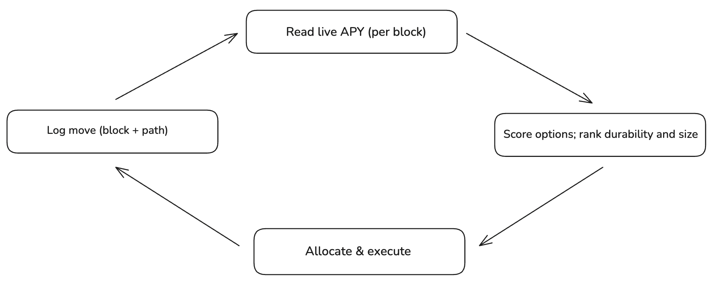

Rosetta’s smart allocation engine keeps capital in the strongest **risk‑adjusted** APYs.

**What it reads;**

- Live APY per block, short‑horizon persistence/volatility
- Total Deposits/flows (depth, crowding)
- Market liquidity, utilization, borrow cost, caps/limits/LLTV
- Programmatic events (parameter flips, composition updates)
- All‑in costs: gas, routing, swap, funding, incentives, slippage

**Behaviors**

- Decides when to **stay**, **rotate**, or **enhance** (e.g., loops, basis/enhanced basis) with guardrails for depth and sensitivity.
- Size adaptively so projected edge survives **after fees and impact**.

**Transparency**

Vetted markets only. User-authorized, non-custodial transactions. Sizing adapts to depth; decisions account for fees and price impact.
You’ll see where capital sits now, timestamped moves, and the path taken.